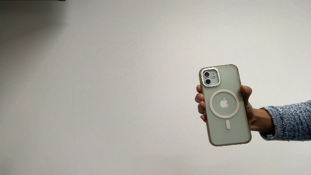

# One-Shot Teaching for Robot Arms using Vision Transformers
Can a robot learn to grab a can from either the left or the right with just a single demonstration? Intuitively, the skills should be the same. In this project, we leverage a Vision Transformer (ViT) trained with DINO to align the robot's current state with the one shown in the demonstration. The model outputs instructions that guide the robot to move its arm, ensuring its pose matches the demonstrated one as closely as possible.

The overall idea is from [DinoBot](https://arxiv.org/abs/2402.13181) (their [code](https://gist.github.com/normandipalo/fbc21f23606fbe3d407e22c363cb134e)), and we leverage the `find_correspondences` functions from the paper ["Deep ViT Features as Dense Visual Descriptors"](https://arxiv.org/abs/2112.05814) (their [code](https://github.com/ShirAmir/dino-vit-features?tab=readme-ov-file#))

Assume our demonstration dataset look like this:


And assume what our current robot wrist camera see is this:



Use ViT to find corresponding points between the two images


Calculate the translation and rotation required for the robot to move to a position as close to the demosituation as possible


## Setup
Download this repo
```
git clone https://github.com/ShirAmir/dino-vit-features.git
```

Set up the virtual environment
```
conda create -n dino-vit-feats-env python=3.9
conda activate dino-vit-feats-env
conda install pytorch torchvision torchaudio -c pytorch
conda install tqdm
conda install -c conda-forge faiss
conda install -c conda-forge timm 
conda install matplotlib
pip install opencv-python
pip install git+https://github.com/lucasb-eyer/pydensecrf.git
conda install -c anaconda scikit-learn
conda install open3d
```

## Run
Run this script to try it out. Code artifact will be saved at `./robot_demo_results`
```
python robot_demo.py
```
